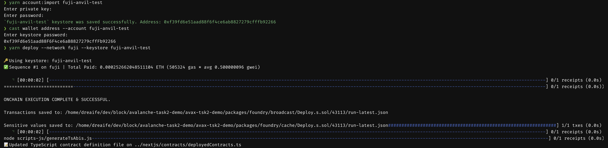
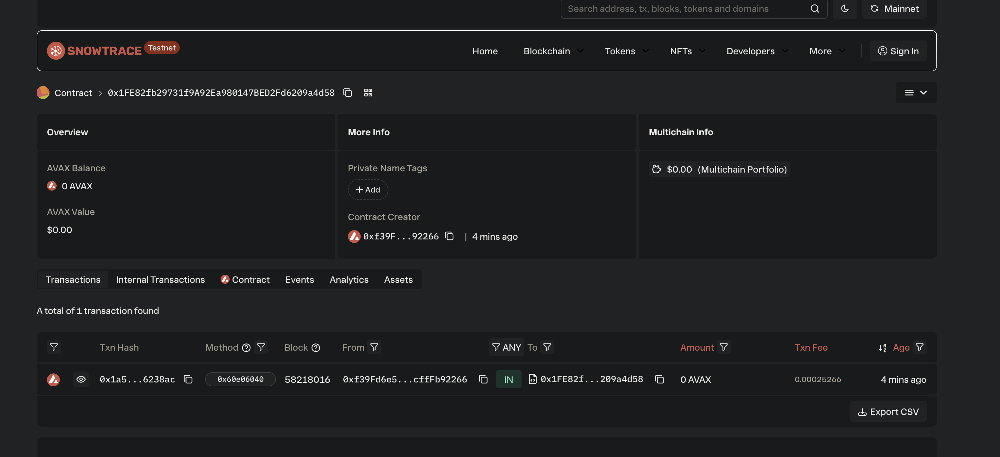

# Task 2：<第二章 Vibe Coding开发你的第一个DApp>

> 对应课程：第二章 
> 截止提交：<9月6日> 24:00:00 (UTC+8)

## 任务目标

掌握 Vibe Coding 技巧，用 Scaffold-ETH 自己部署 ERC20 合约的应用

## 参考资料
Scaffold-ETH 项目开发模板
https://scaffoldeth.io/
https://github.com/scaffold-eth/scaffold-eth-2

领取 Avalanche Fuji 测试网 token
https://build.avax.network/console/primary-network/faucet

## 任务要求
把合约成功部署至Avalanche 测试网

## 提交方式
提供部署成功后截图，以及链上合约的地址

## 截止时间

<9月6日> 24:00:00 (UTC+8)

## 我的提交

- 合约部署成功

- 链上合约地址

链上合约地址: [0x1fe82fb29731f9a92ea980147bed2fd6209a4d58](https://testnet.snowtrace.io/address/0x1fe82fb29731f9a92ea980147bed2fd6209a4d58)
